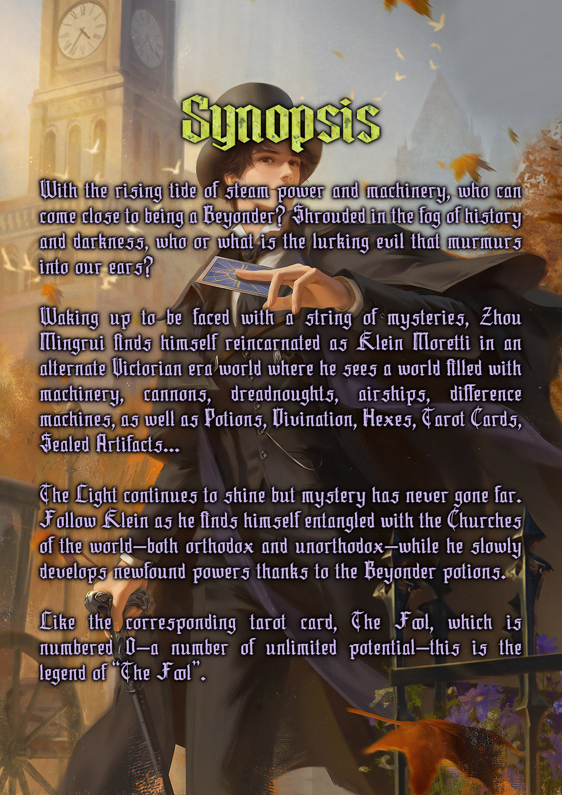
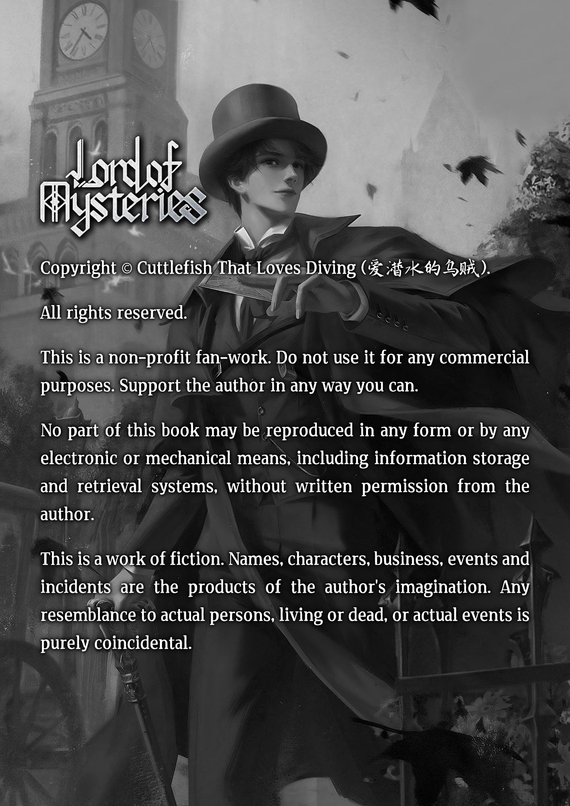
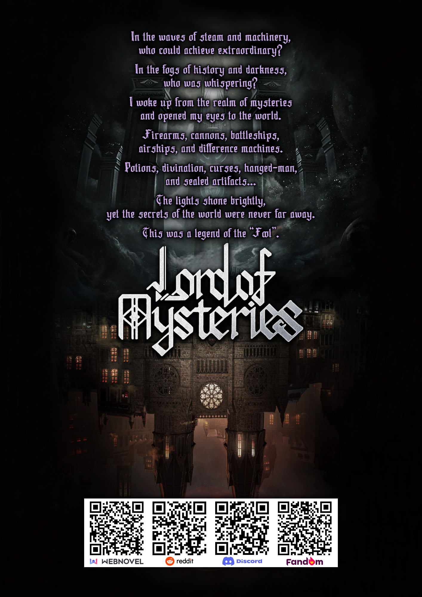

---
title:
  - type: main
    text: 'Lord of the Mysteries'
creator:
  - role: author
    text: 'Cuttlefish That Loves Diving'
contributor:
  - role: translator
    text: 'CKTalon, Windvally, LOTM-Reader'
identifier:
  - scheme: URN
    text: 'urn:uuid:lotm-reader-lotm-webnovel'
language: en-GB
subject:
  - text: 'Fantasy'
  - text: 'Mystery'
  - text: 'Steampunk'
  - text: 'Transmigration'
description: >
    With the rising tide of steam power and machinery, who can come close to being a Beyonder? Shrouded in the fog of history and darkness, who or what is the lurking evil that murmurs into our ears?
    
    Waking up to be faced with a string of mysteries, Zhou Mingrui finds himself reincarnated as Klein Moretti in an alternate Victorian era world where he sees a world filled with machinery, cannons, dreadnoughts, airships, difference machines, as well as Potions, Divination, Hexes, Tarot Cards, Sealed Artifacts…
    
    The Light continues to shine but mystery has never gone far. Follow Klein as he finds himself entangled with the Churches of the world—both orthodox and unorthodox—while he slowly develops newfound powers thanks to the Beyonder potions.
    
    Like the corresponding tarot card, The Fool, which is numbered 0—a number of unlimited potential—this is the legend of "The Fool."
rights: 'All rights belong to the original author and licensed platforms.'
publisher: 'LOTM-Reader'
belongs-to-collection: 'Lord of the Mysteries'

group-position: 1
toc: true
toc-depth: 2

metaBook: lotm
metaTl: OldTL

page-progression-direction: ltr
accessModes:
  - textual
accessibilityFeatures:
  - alternativeText
  - readingOrder
  - structuralNavigation
  - tableOfContents
accessibilitySummary: 'This EPUB is a compiled version of the webnovel chapters with structural navigation and TOC.'
---

# Foreword {epub:type=foreword}

**Lord of the Mysteries (诡秘之主)** is a Western fantasy web novel written by **Cuttlefish That Loves Diving (爱潜水的乌贼)**. Originally published on **Qidian** in 2018 and translated by **CKTalon** on **Webnovel**, it consists of 1,394 main chapters, 36 side stories, and two bonus chapters.

This edition is a community-driven build by the **LOTM-Reader Project**, accessible at [beyonder.pages.dev](https://beyonder.pages.dev).

___

* **Compiled & Edited by:** LOTM-Reader Project
* **Translations by:** CKTalon, Webnovel, and Community Contributors
* **Illustrations by:** Official Weibo of LOM, 叁乔居, Ghon3, 阙憾空城
* **Fan-Illustrations by:** Credited under the Illustrations
* **Last Updated:** {{DATE}}
* **EPUB Type:** {{TYPE}}

___

# Synopsis {epub:type=abstract .epub-invis .epub-no-break}

# Volume 1: Clown {epub:type=titlepage}

<!-- [vol1] -->

# Volume 2: Faceless {epub:type=titlepage}

<!-- [vol2] -->

# Volume 3: Traveler {epub:type=titlepage}

<!-- [vol3] -->

# Volume 4: Undying {epub:type=titlepage}

<!-- [vol4] -->

# Volume 5: Red Priest {epub:type=titlepage}

<!-- [vol5] -->

# Volume 6: Lightseeker {epub:type=titlepage}

<!-- [vol6] -->

# Volume 7: The Hanged Man {epub:type=titlepage}

<!-- [vol7] -->

# Volume 8: Fool {epub:type=titlepage}

<!-- [vol8] -->

# Side Stories {epub:type=titlepage}

<!-- [side] -->

# Afterword {epub:type=appendix}

Originally I was planning on taking a rest, and start writing this tomorrow. But maybe because this is a sensitive time period (due to the recent developments). Many friends private messaged me with all kinds of text message and mails, asking me questions. I was thinking of having a good afternoon nap, relaxing the excitement that I built up from writing the conclusion, but my phone kept going verrrrrr…….

^&&%^ I……Do you guys want me to sleep or not.

Ending before June is something that has been planned ahead a long time ago. I’ve stressed this point quite early, it’s just that at the time I could not predict it exactly, so I said it very vaguely, stating no later than June. After all, I have to leave out enough room for flexibility, right? If it weren’t for the Corona virus, I probably would be packing my things and going on a tour in Spain in the next few days.

Also, my contract was signed at the end of 2016. And the contract ends at early 2022. There’s one more book (under the contract) left, and it’s going to be about 3,000,000 words. This new book is definitely going to be released on Qidian.

Now that we finished the unrelated topics, let us get back to the book itself.

If we talk about the tail end part of Volume 7, where I chose the more logical development (Adam not waiting for Klein), leading to the story suddenly speeding up, unable to have more detailed and fulfilling development. Then it really was my fault in Volume 7. But, in Volume 8, starting from chapter 1 of this volume, everything is within my control, as I’ve made up my mind beforehand. Which chapter should write what? Where to have a twist? How to wrap up the end? I’ve finished thinking about all those things. So the problem of “story suddenly speeding up”, and “too many side quests/branches getting cut off” don’t exist.

This ending, I have already decided on ending it this way before I even started writing LoM 1. Every Member of the Tarot Club, after experiencing a myriad of Passive-ness, hope/expectation, Lose/confusion, and stagnation/hesitation, finally escape from each of their own comfort zones, to face this world, to face all types of difficulties. And for Klein and Azik, they achieved a reincarnation and cycling on their roles.

When the ending arrived (Klein’s Niece), Eerie Mysteries and Innocence, Dimmed light and Blazing sun (the room and the window), Darkness and Rebirth becoming vivid comparisons. Forming a scenery that’s rather unique and amazing, a mix of Cthulhu vibe and warmth at the same time. At the same time it pointed out the detail and fact of — “Klein has achieved initial stage of waking up”. This makes sure people know that this book series isn’t “eunuch-ed”.

As for the hidden storyline buried by the five gold coins, each Tarot Club member’s experience and stories, and every other hole that I dug in LoM 1 that wasn’t a part of the Main Storyline (Klein’s Story), they are of course material left purposely for LoM 2. I really really was very blatantly clear with my writing, that this last part is both an ending, but also a prologue.

Mmh, LoM 2 story is going to be set in-between “Klein Sleeping or even a little bit before he went to sleep” and ends with “He wakes up”.

Even this time frame setting about LoM 2 was something that was decided before LoM 1 was even written. Why did I consider a second book when doing my settings? For one, I feel my world setting is too huge and detailed, there are way too many things to write about. If I were to dump everything into one book, then inevitably there will be a confusion of Main storyline and Side storyline; Unnecessarily long Side Storyline; Scattered and Boring; Structurally Bloated to an unsightly degree. Secondly, the growth curve of the Tarot Club Members cannot keep up with our MC Klein. If I gave them too many Side Quests and more stories, for the sole purpose of justifying and making their “improvement” logical enough, then it will crash against the Main Story’s structure. This will also cause the problem of confusion of Main/Side Storyline. If I don’t give them those extra quests and stories in LoM 1, and still let them grow, making the Tarot Club members exert critical influence and usefulness at crucial moments, then it will only make the readers feel cheap. There will be a great number of readers/friends who will feel that the Tarot Club members just rode on the Klein Train and sucked off of the Main Character’s plot armor aura. They will feel that the Tarot Club members obtained everything “too easily” or “Because they are main side characters needed to defeat Error, etc., etc.”

So, after balancing all my options, combining all situations from different perspectives, I made the final decision and oath to at least MUST write an LoM 2. In this way, LoM 1 could leisurely walk its Main Storyline, doesn’t have to go “dungeoning” and “farming exp” all over the world map, keeping the focus in one country, in Backlund. And Tarot Club members are only finishing up their life’s first half, completing metamorphosis and growth, and leaving their comfort zones. They will go to LoM 2 to demonstrate to us, an even grander, more amazing, and more exciting life and story.

For me, this is also a challenge. How to, after a few years later (remember it won’t be until AT LEAST 2022 for LoM 2), to bring every reader back into this world. How to allow new readers, who never read LoM 1, to also smoothly read LOMT 2 without any difficulties and limit. Before LoM, I don’t have experience with writing series/trilogy type books. I don’t have the experience of writing a second book under the same world setting. On one side, I didn’t even think about going “series” when making the setting for the previous few books, lacking the appropriate amount of space to expand. Secondly, I was afraid to repeat the formulas and cliches of “the first book” in “the second”, unable to make breakthroughs in my writing ability. But this kind of fear is also a self-limit in of itself, now I feel confident enough to try challenging it, as I have already found my own writing philosophy.

I said in the past, my favorite saying…no…my motto is:

“Never satisfied, always challenging.”

For LoM2, I haven’t decided on the Main Character, and how this character is going to cut into the story. but right now within my mind some story scenes have already popped up:

It will be Hidden Storyline composed of: Every single member of the Tarot Club, and their many attempts at awaking Klein; Using the five gold coins and the iron cigar box to represent different characters.

The Main Character of LoM 2 may encounter a Hunter Pathway who light up a cigar and talk about the past; He may occasionally peek/be shown a beautiful, half-covered face; He may hear about a NEW CONTINENT being discovered abroad; He may interact with the Kings and Queens of the Five Seas; He may go on an adventure to explore those remaining, shrouded legends of treasures; He may come into conflict and interaction with “Transmigraters” of all kinds (released from cocoon), and “infiltrators” of all kinds; As for the exact “genre”, I will have to decide on it later. All in all, from a world setting perspective, I left a crap-load of space for LoM 2. I am absolutely not worried about not having anything to write about.

As for The Apocalypse, it’s not something that can be solved with one book. And in order to make The Apocalypse in the second book more “Pressing” and “Choking”, I decided to give Mother Goddess of Depravity a mythical grade upgrade and reinforcement. Joking! Anyways, using a Chinese novel synopsis written in comedy style, I want to say: Why are male pigs pregnant? Why is a man having a bloated belly? Why did a rock give birth to a child? Behind all these incidents, was it the distortion of human morality? or the corruption of virtues?……….As for how this upgrade is done, it will probably be put into LoM 3 that is about the Western Continent. But I might not write that book, Serious Face.

Western Continent related settings — I actually didn’t create these settings beforehand, all I did was leave an “electric outlet”, an opening ready for connection at any time. The remaining 7 Sefirot that are stuck there, the very few beyonder characters there (There’s no Sequence 1 BC and Uniqueness on Western Continent - cuttlefish word), what kind of world would this situation create, and what kind of power system would that isolated continent have?

I recently confirmed my fundamental ideas for the Western Continent, I know what kind of setting I will be making, hehehe.

Mhh, Western Continent will have Orthodox Sect system with the Sefirot as the core; And the Alternative/Demonic/Freelancer sect system that uses the 9 through 2 beyonder characteristics as the basics and foundation; And the Lower/Third Grade “Normie” Sect system who has to use a mixture of Sefirot and Beyonder Characteristics to level themselves.

The Sefirot as Orthodox Sect is inspired by Daoism’s concept of “Ordained”, and created following that line of thinking. Mmmh, “Ordained” means if you are recognized by the “Heaven Palace” (Sefirot), you will become a part of this system, and you can happily summon “Servant God” to help you fight. For those who aren’t ordained by a divine realm, when they want to summon “Servant Gods”, why would these summons even give a fuck about you? So this create a “class separation” between the ordained and the un-ordained. Those who are “ordained” are basically “within the political system” per se. After that, if I change the “Heavenly Palace” and “Sacred Land” in Cultivation genre into Sefirot. Tada ~ the whole setting of this cultivation-ish world becomes eerily mysterious and lively.

I’ve written this much Afterwords, now I’m hungry. My wife is pushing me along and wants me to go out to buy food right now….after all, this Afterwords was a sudden decision. Mmmh, I should finish writing it right here, I will continue this Afterwords tomorrow. I will talk about this Book — LoM 1’s thoughts and lessons after creation. I will talk about my writing and creation methods and philosophies.

Also, extremely grateful to XXXBig Boss’s donations, when I opened up Qidian Reader just now I was almost scared by the surprise. Also, after this, I will release a bonus 20,000 to 30,000 words bonus chapter as a fixed schedule update. Then from that point onward, future bonus chapters will be irregular, non-fixed time updates.

Originally I wasn’t planning on writing these bonus chapters. But then I discovered that there are so many things I could write that don’t involve contents in LoM 2. For example, Klein’s dreams when he’s sleeping. Fragments of stories and tales from the 4th Epoch, etc., etc.

In regards to how *Lord of Mysteries*‘ revival backup plan using cocooned people was disrupted, causing Both Evernight and Rosselle to get out without much trouble, and only started self-correcting by the time Klein was released (and he was helped by Evernight to escape that correction in Volume 1 chapter 1). I have already done a certain amount of hidden hints and allusions:

“Magic Mirror” Arrodes, as an existence that came out of the Sea of Chaos, why does it insist on 100%, must follow Klein around? Why did Klein bring Arrodes with him when he decided to go to sleep against LoM?

Also, the physical published version of the book’s revised edition is out. This time the cover is a cover that I liked personally. The content also corrected some words that don’t exist in dictionaries or online dictionaries, such as the “HIM” for gods. For the detailed way of purchase, you can look at my Weibo. For the release time for the irregular Bonus Chapters, you can subscribe to my Wechat official account. The Wechat official account ID is “wuzei1985”, the one with an anime avatar as profile icon.

Mmh huh, tomorrow we will continue with Afterwords (Part 2).

___

**CL Note:** No one has translated the Afterwords (Part 2) yet. I’ll add the Part 2 once it is translated. In the meantime, you can try the [raw version](https://www.ddyueshu.com/5_5552/542033733.html) and read it using *Google Translate*.

___

