## Chapter 1266: Light 

For a demigod Beyonder, they experienced a qualitative change due to
their powerful souls. Even in death, their psyche could persist for some
time. Unless this was circumvented due to an enemy deliberately
destroying it, a High-Sequence Beyonder, who continued having a strong
desire or unresolved matters during their state of death, could have
their remnant will last longer. As such, he could slowly assimilate the
surrounding areas, allowing it to mix with the spirit world, and even
the Underworld, so as to turn it into an evil spirit.

Therefore, although Colin Iliad had stopped breathing, he was still able
to hear Derrick's cry while sitting at the top of the ancient god's
staircase in tattered silver armor. He turned his head to look at the
underaged demigod before smiling.

"Compared to the Elders of the past, it's a form of luck for Lovia and
myself to die here."

Upon hearing this, Derrick gaped his mouth, wanting to say something,
but felt something pressing down on his heart, blocking his throat.

Not far away, Klein raised the Staff of the Stars and attempted to use
Will Auceptin's "Reboot" to save Colin Iliad. However, he failed several
times in a row. Even the successful attempt didn't have the ability to
reverse everything. The effects were clearly inferior to the original's,
and it involved a Uniqueness---Amon's true body had descended.

*He's already dead, so he can't even be turned into a marionette. He can
only consider turning into an evil spirit, but there's almost no evil
spirit that can maintain their humanity. Even Dark Angel Sasrir failed
to do so... The only exception is the Red Angel Medici trio. But that
was only after "They" left "Their" "territory" and went to Bansy
Harbor... This Chief doesn't seem willing to take this route... To the
residents of the City of Silver, becoming an evil spirit is undoubtedly
a curse...* Klein sighed and cast his gaze elsewhere to observe the
Giant King's palace that had its shadows recede.

Colin Iliad examined Derrick's face and sighed.

"When you return, you'll be a member of the six-member council.

"I know. Relative to your age, this is a very heavy responsibility, but
everyone in the City of Silver has to be prepared to shoulder everyone's
fate."

Derrick nodded and said with a nasal voice, "Yes, Your Excellency!"

Colin Iliad revealed an amiable smile.

"Don't be worried that they'll misunderstand this. I'll tell you a
secret. Currently, in the City of Silver, only Waite and I know of it.

"When you get back, tell this to Waite immediately. He will understand
that Lovia's and my death has nothing to do with you. Otherwise, you
will not obtain this secret from me."

Having said that, Colin Iliad looked up at Gehrman Sparrow and nodded
gently.

"From today onwards, everyone in the City of Silver can freely change
their faith to Mr. Fool."

Derrick wasn't excited at all. He nodded heavily, indicating that he
understood.

Colin Iliad immediately retracted his gaze. A layer of solemnity and
bitterness appeared on his clearly exhausted face.

"That secret is related to the second god-level Sealed Artifact of our
City of Silver.

"It's called 'Gift of the Land.'"

Derrick wiped his eyes with his arm and listened attentively to the
Chief's description.

Colin Iliad sighed and continued, "It's precisely because of this Sealed
Artifact that Black-Faced Grass can grow around the City of Silver,
preventing us from completely sinking into the dark ages..."

Derrick's pupils dilated as the sadness in his heart eased.

He remembered very clearly that the textbooks mentioned the discovery of
Black-Faced Grass as the key turning point in the history of the City of
Silver. He believed that if there was no such safe and harmless staple
food, then the City of Silver would've long become a playground for
monsters.

At that instant, Derrick thought of many things. He finally understood
why the mushrooms that Mr. World had given had undergone a huge
transformation in the City of Silver, one that was different from the
original description.

Colin Iliad's gaze swept across his face, and his voice suddenly turned
deep.

"It's precisely because of this that we are burdened with the fate of
being cursed. Only people who are killed by their immediate family
wouldn't become a terrifying evil spirit.

"Cornucopia has a price."

Derrick's expression froze.

Murdering his parents left a wound that could never heal in his heart.
He had always blamed the corresponding curse on this land that had been
forsaken by the gods. But now, the Chief had told him the truth which
was unlike what he imagined. The curse gave them the food they relied on
for survival!

The grizzled and exhausted-looking Colin Iliad's eyes glazed over as he
seemed to recall killing his father, mother, brother, sister, eldest
son, youngest son, daughter, and eldest grandson.

His voice became fleeting.

"Lovia once said that a dying person would not transform into an evil
spirit after leaving the City of Silver.

"Back then, I didn't tell her that this was the truth. As the Gift of
the Land's range is huge, most people who are about to die are unable to
leave the corresponding region in time.

"This is a secret that only the Chief can grasp. I tried my best
exploring and fighting, hoping that future generations wouldn't have to
suffer such pain."

The Chief of the City of Silver, who was clearly advanced in his years,
slowly exhaled. Without giving Derrick a chance to make a promise, he
seemed to recall something as he said, "Also, you mustn't fully believe
the situation of the Rose Redemption that is recorded in that palace."

*Eh?* Klein stopped scrutinizing his surroundings as he revealed a
slightly lost expression.

Colin Iliad added in a deep voice, "Earth Mother cannot be Giant Queen
Omebella.

"Omebella has long died. 'Her' corpse is in the City of Silver, and more
precisely, it's the Gift of the Land..."

*This...* When Klein heard this, his pupils dilated as a chill ran down
his spine.

The real Giant Queen had long died in the City of Silver and became a
Sealed Artifact. Then, who is the one currently masquerading as Earth
Mother?

___

In the kingdom that was covered in moon flowers and night vanilla, the
sunset giant's sword struck the heavy, pitch-black sickle and froze in
midair.

In the darkness that had been destroyed by the intense battle of the
gods, time seemed to come to a halt. Be it the giant wearing tattered
armor who was bathing in the dusk, or the humanoid demonic wolf with six
arms, "They" seemed to become a part of an oil painting. Everything
stood on the spot, maintaining "Their" previous posture.

However, a dark brown wooden cane had stabbed through the back of the
sunset giant, piercing through its heart as it frantically drained the
life of the deity, dragging "Him" down in an act of returning it to the
land, returning to a mother's embrace.

This dark brown wooden staff was held in the hands of the giant-like,
voluptuous woman. It formed a deep autumn scene with the withered
flowers, grass, and mushrooms.

The sunset giant slowly turned "His" head and looked at the woman who
was carrying the baby in one hand. "He" said in pain, "Li---li---th?"

At this moment, the dress-wearing "demonic wolf" with the head of a
female human let out a chuckle. The bird-shaped golden accessory in
"Her" hand flew out and accurately pierced through the gap of the sunset
giant's visor. Then, "She" threw the "Crimson Moon" in "Her" two other
hands at the voluptuous woman.

In the next second, a portion of the sunset giant's body collapsed. An
orange-red sunset pierced through the serene darkness and landed in the
real world.

Some landed on the battlefield, causing countless soldiers to die. Some
crushed the mountains, creating a lake that made all living creatures
age. Some fused with some lucky creatures, turning them into crazy and
powerful monsters, while others enveloped the Great Twilight Hall
outside St. Millom. The solidified orange light was extinguished...

In the Amantha mountain range, outside the Cathedral of Serenity,
Abomination Suah and other Mythical Creatures, who were helping Feysac
and Intis angels attack, seemed to sense something. The battle came to a
halt.

After the bloodshot eyes growing on the pitch-black tree rolled once,
Abomination Suah immediately entered the void and escaped into the
spirit world.

In the outskirts of Backlund, in a small cathedral that no one paid
attention to.

A golden-bearded pious priest wearing a simple white robe opened his
eyes. They revealed a childlike innocence and purity.

"He" calmly took out a golden potion and opened the lid, pouring the
liquid inside into "His" mouth.

___

The war ended just like that.

If Audrey hadn't seen it with her own eyes, she never would've believed
that the war would end just like that.

After the dark night swallowed the orange dusk and faded away by itself,
the Silver Knight in front of her seemed to suffer a heavy mental blow.
Even after recovering and composing himself, he didn't continue
attacking his enemy. He fled in a rather sorry and perplexed state.

Just like this Silver Knight, the angels and saints of the Feysac and
Intis allied forces fled one after another. As for the Beyonders that
formed the backbone of the army, they collapsed in an uncontrollable
manner.

However, on Loen's side, the demigods, Low- and Mid-Sequence Beyonders,
and ordinary soldiers didn't attempt to pursue them. This was because
they were equally confused, perplexed, and puzzled.

Audrey walked back into the city and saw the surviving Backlund
residents coming out of their houses, shelters, or hiding spots, one
after another. They stared blankly at the scene which resembled a
primeval forest.

They didn't cheer, shout, or vent their emotions. Their expressions were
numb, and their eyes were vacant. They didn't know how and why the
disaster had suddenly ended.

There was no lack of people who had once been saved by the charity
foundation. Many of them looked familiar to Audrey, but their condition
wasn't much different from when those who queued up to collect food.

Audrey silently observed this scene before returning to Empress Borough
and back to her villa.

She saw her father, mother, elder brother, butler, servants looking out
of the window in confusion, just like the citizens on the street.

For some reason, a sentence suddenly flashed across Audrey's mind:

Dying, he knew not his executor; surviving, he knew not the
circumstances.

___

An orange dusk calmed the lightning storm that blazed with frequent
bolts of lightning. It sank into the dark, blue sea with an
indiscernible bottom, nearly swallowing the Dawn with it.

Queen Mystic had used her other Grade 0 Sealed Artifact in time,
allowing the ship to avoid a terrifying disaster.

She frowned slightly as if she had sensed something. However, her
expression eased up immediately, allowing the Dawn to continue moving
forward on an unsafe sea route. It was to engage in all kinds of
dangerous battles with strong winds, huge waves, lightning, and sea
monsters.

In the dark environment, Bernadette's gaze seemed to penetrate through
many obstacles, allowing her to see the light that she was chasing
after.

No matter how many obstacles she faced, she would not stop her approach.

___

On the staircase in the Giant King's residence which was covered in
orange light.

After telling Derrick the secret, Colin Iliad said to Derrick, "Go. Open
that door. I want to see what the sunlight outside is like..."

"Yes!" The rims of Derrick's eyes reddened once again. He pursed his
lips tightly and stood up.

He put down the hammer in his hand, and under the encouraging gaze of
Klein, he steadily circled around the iron-black throne and arrived in
front of the grayish-blue door which depicted the sunset.

Derrick stared at it for a second, bent down, stretched out his hands,
and pressed them against the sides of the door.

Then, he strained his muscles and pushed hard.

At that moment, he seemed to see his parents; his deceased teammates,
like Joshua and Antiona; Lovia in a purple-patterned black robe; and the
grizzled Colin Iliad.

They stood beside him and pressed their hands against the door, pushing
the grayish-blue door with him.

Beads of water streamed down Derrick's face as a heavy creaking sound
echoed in his ears.

A crack appeared, letting golden sunlight flood in.

The gap grew bigger and bigger, and a golden sea gradually appeared in
Derrick's eyes, presenting itself in front of Colin Iliad's eyes.

Upon seeing this scene, the corners of Colin Iliad's lips twitched
slightly as he bathed in the warm sunlight. The corners of his lips
pulled up slightly as he revealed a faint smile and a faint yearning,
his body "evaporating" bit by bit.

Light was the meaning to everything.

Author's Notes:

---**Translation:** Mrs. Matchstick Bepis \| **Proofread:** Windvally---

The 116 chapters of Volume 6, to me, achieved the overall degree of
completion I expected.

During Volume 5, I mentioned that the pinnacle of the plot would occur
in Volume 6, note that I said pinnacle, and not climax.

Laughs

At the time, it was clear to me that it would be lacking in terms of
satisfaction and explosiveness, but the essence of the volume was to
bring a strong sense of shock. Regarding this, when Amon uttered
Chernobyl and when Colin Iliad said that Omebella had already died, I
could clearly feel the sense of happiness writing brings me.

Accordingly, chapter subscriptions exceeded 60,000, breaking the record
of the entire book, especially during the Amon arc, reaching over
63,000. As for this Omebella chapter, because I wrote this conclusion
before the 24-hour mark, I didn't have an accurate result, I only know
that during the first hour after the chapter was uploaded, chapter
subscriptions were already at 32,000.

These are the two pinnacles of Volume 6, one at the beginning and one at
the end, stringing together the entire volume. Both of these events were
arranged as early as Volume one. Even before I started writing Volume
One, these ideas were already thought-out and I started consciously
burying hints to depict the two events. When I first wrote "Chapter One
-- Crimson", I already had a complete picture in my mind, one of which
was an inspiration that gradually took shape as I was putting together
the story of the City of Silver and its curse, it was only after this
that Emlyn and the Church of Harvest came to be. I actually provided a
lot of corresponding clues, although they were relatively hidden, it
wasn't without foreshadowing.

And surrounding these two pinnacle, many secrets have been unveiled.
Generally, I don't think there were any problems regarding this portion.
It helped to gradually give shape to the overall universe, creating a
comparatively complete framework, thus, when I start unfolding
information and hints regarding the The Old Ones, Outer Gods, Ancient
Sun God and his family, it would become a lot smoother. Family, yes,
using this term to describe them seems to make them a lot more
relatable.^[Cuttlefish uses an idiom, 煙火氣 which is an abbreviation for 人間煙火, which in essence describes the life of ordinary, mortal and mundane people. The literal translation describes the need mortals have to eat and toil to live, unlike immortals who do not require sustenance, which is why I translated it to relatable.]

[Speaking of relatable, I would have to discuss the criticisms directed
towards the war and
][「][Justice][」][.]

Throughout the time I spent writing Martial Arts Master, I have been
compiling a set of methodologies for writing suitable for myself,
however at the same time many things were still vague to me, it wasn't
until I started writing *Lord of Mysteries* and the corresponding
experiments and results, that things started becoming clearer, thereby
adding to my methodology.

To me, the first business of writing, which is also the most important
step is encompassed by a very rustic word:

[「][Expression][」][.]

What is it that I wish to convey and deliver? This is something that
must undergo clear consideration before setting pen to paper, after
that, I would need to make a choice regarding what I will include or
omit in the writing to make sure my focal point doesn't deviate.

To put it simply, I will use a phrase that everyone abhors: centralized
thoughts.^[Referencing peoples' dislike of one of the tenets of the Chinese educational system, whereby there is only one correct answer to very subjective questions.]

Then what is it I wish to express in Volume 6?

First of all, it is the sense of impact that these two plot points will
bring.

Secondly, the insignificance and helplessness mortals feel when in the
face of gods.

Thirdly, despite being as small and insignificant as a moth, one should
always seek the light.

Regarding the second point, this theme isn't exclusive to Volume 6, it
is an inevitable component of any novel worldviews inspired by Cthulhu
and the Quasi-Cthulhu Mythos. Ones'[^12663] fear of the unknown as well as the
insignificance when faced with that "unknown", which is in the same vein
as the straw men from Volume 2^[Regarding the reference to Volume 2 and straw men, Cuttlefish is referring to the events in Volume 2 Chapter 263/Chapter 476 - Straw Men, in which the life of the innocent and impoverished people of Backlund were but fuel (straw) for the various conspiracies.].

[^12663]: Cthulhu meaning the original H.P Lovecraftian lore and Cthulhu Mythos, the combined fictional (or is it?) universe of the entire trope, setting and mythology shared by Lovecraft and his literary successors.
The more literal translation of the same terms could refer to a Chinese Cthulhu taletop RPG circle. The Cthulhu Mythos style represents campaigns that focus on adventure, treasure hunting and direct confrontation against an eldritch entity with no sugar coating eg: Eldritch Horror and Arkham Horror. Quasi-Cthulhu Mythos represents campaigns that look completely normal on the outside, focusing on the day to day lives of mortals in rural or urban areas, while e verything dark is moving in the shadows, puzzles which needs to be solved by the players. This represents a shift in the preference of players, as more and more players in China enjoy the Quasi-Cthulhu style, as it offers more variety and realistic horror (more helpessness) than straight up Bloodborne style hunting.

    Windvally: I may be COMPLTELY wrong on this, but that's one way to look at it.

Therefore, before I started writing Volume 6, even before Volume 5, I've
been considering what kind of story would be necessary in order to
deliver the things I wish to express into the readers' mind.

If I started to expand on the war, then the focus would shift to the
various mystical powers, battleships, machine guns and cannons. This
would comparatively be more fresh, and with the inclusion of elements of
sacrifice, exhilaration, the brutality of war and other deeper themes,
it would deviate from the crux of what I wish to express. Because once
you arrive on the battlefield, the significance behind death and
survival become apparent, there wouldn't be a sense of befuddlement over
why you're still alive or why you're dying.

At the same time, the story has always depicted fights between
Beyonders, and arriving at Volume 6, I even began unravelling the
secrets behind the various Kings of Angels and Gods, if I was to also
expand into the war between ordinary humans, not only would the two
sceneries conflict with each other, it would be rather weird as well.

With this in mind, as I mentioned very early on, I wouldn't go into the
details of the war, instead the primary focus would be on the life of
ordinary people embroiled in the war. I purposefully made these people
indistinguishable and without names, which is another interpretation of
the title of Volume 2, Faceless, to exemplify the concept of the
numerous, of the masses, and to decrease the relative pain and sorrow
people feel, instead accentuating the feelings of loss, apathy and
confusion.

The only people with a name were the Landlord and lady, this part was to
emphasize the pain and hardship of the people, otherwise the scene where
Audrey determines herself, kneels before her parents' bed and kisses
them before leaving would lack the necessary force.

Originally, there was no need for the scenes where Audrey engages in
charitable behavior to be repeated, but in order to increase the sense
of apathy, stupefaction, pain and confusion of the people, I
intentionally wrote a few more of these scenes, consequentially these
scenes were a little monotonous and insistent, whilst failing to reflect
the changes within Audrey's heart.

However, I don't think there were any problems with her two
conversations with Klein, each encompassing a different sense of
confusion; nor were there problems with her behavior after resolving
herself and her subsequent manipulations. There was no delay, no
encumbrance because she has her own internal conflicts and the relevant
tensions in the story still exists.

In summary, I combined the build-up of determination within Audrey's
heart, her own growth and the insignificance of mortals together, and
combined them into one thread, resulting in a situation where I'm
writing about her, but the real focus wasn't on her, which made Audrey
seem like a tool^[工具人, a tool-person, is someone who helps you without reservation, but you never reciprocate their feeling or acknowledge them. They comfort themselves with the fact that you might need them after all. An example is Ikanser Bernard of the Machinery Hivemind, aka the sacrifice to communicate with Arrodes.] for the plot.

[This is probably a
][「][Spectator's][」][, mandatory
duty and sacrifice.]

Sigh

However, I would like to thank everybody for your tolerance and
understanding, during these chapters, subscriptions basically didn't
drop, resting at around 53,000, it let me proceed calm and nonchalantly,
enabling me to encompass everything I wanted to express.

During the final battle at Backlund, the reason behind unfolding it from
Audrey's perspective was to demonstrate the changes the battle between
gods would bring to Backlund, and to conclude all the things that I have
been paving for up to that point.

As this Spectator walked down the streets and alleys on her way home,
she witnessed the same confusion inside everyone, down from normal
citizens, up to nobles and finally to herself, a demi-god, welling-up
and culminating in the lament:

"*Death without reason, life without purpose*"

I have this impression that the relevant plot wasn't a waste of time,
and I feel like the plot which was somewhat adrift has finally found
its' grounding, deep, heavy, stable and solid.

Additionally, this part also ties into the build-up of emotions in three
parts, from the senselessness, insignificance and sorrow that Audrey
experiences, to Bernadette's pursuit and certainty that regardless of
how dark and bleak the journey would be, she would continue, and finally
to the City of Silver, which has spent millennia questing the darkness,
who have at last, opened the door, laying eyes on a sliver of light and
on the thing named hope.

It is for this reason, my original plan to feature Roselle in Volume 6
was pushed back to Volume 7.

[Hmm, this progression of emotions could be reversed, but that would be
extremely despairing, it wouldn't suit the title
][「][Lightseeker][」][.]

Regarding the death of the Chief, because Lovia died earlier, I didn't
want to reiterate the sorrow and sensationalize it, instead it was with
restraint that I described his condition, to let the relative sorrow be
hidden deeper and instead focus on the light, on his expression of
regret, release and hope.

The problem with Volume 6 was that it required too many battles cramped
in succession, the middle of the volume lacked the necessary pacing for
the tension to loosen, resulting in reading fatigue. This is something I
would need to pay attention to in Volume 7.

Besides, if I don't write about the war, I would lose the chance to
expand on the rest of the world, it would seem like the scope of the
story was limited, however this was something that I anticipated. With
the existence of 22 pathways, numerous different countries, gods and
angels, if I was to open up these areas, Kleiny boy would end up having
to run all over the place, that would feel very cumbersome and bloated.
It would be akin to a dragonfly skimming the surface of the water, to
scratch the surface superficially, and not go deeper. I might as well
not write it.

Therefore, even though I already have a very detailed framework
enveloping the Republic of Intis, the Kingdom of Feynapotter etc, I
can't introduce them. Regarding this, a certain "one and a half metered
classmate" could testify on my behalf, while I was making preparations
for *Lord of Mysteries*, she asked me what the outline of the story was,
so I copied a portion of the settings surrounding Intis, and that was
probably a very detailed version of it.

This was something I set my mind on before I started writing *Lord of
Mysteries*, I would limit the scope of the story to the utmost extent,
focusing instead on one country and making it as vivid and meticulous as
possible, thereby bringing out the distinguishing characteristics of
other countries in contrast, establishing a more coherent framework for
the entire world. Achieving this, the purpose behind writing *Lord of
Mysteries* would be accomplished. Hmm, you guys should be able to feel
that I've been keeping some things back.

Concerning the other countries and other pathways, I originally hoped to
manage it, that is, under the same world, to write a second, maybe even
a third book, under different perspectives, using things that I didn't
have a chance to use in regards to Intis, Feynapotter, the various
secretive cults, organizations, the Western continent and other products
of my world-building, utilizing this approach to complete the entire
universe of *Lord of Mysteries*.

I even thought about some possible storylines that I may or may not take
up, for example a certain Blessed One of The Old Ones attempts to
infiltrate and sabotage things, but fall prey to an accident, losing
their memories and eventually getting picked up by the Church of
Knowledge and Wisdom, "indulging" in exams and textbooks day in day out,
or someone who starts out as a hunter and ends up receiving instructions
from Saint Danitz, crying as he loots Anderson, contesting wit and skill
with the Red Angel, etc., etc.

This might be the main storyline of the second book. As for the third
book, it might be a story based on the Western continent, an Eastern
oriental themed *Lord of Mysteries*. I was smiling as I read comments on
how you guys theorized a "Sky Lord of Heaven and Earth" route. Of
course, regarding the power level of the Western continent, I left a few
connections, but nothing concise yet.

Hmm. There might not be a third book, but at the moment, I can promise
there will be a second book, but it wouldn't be the next one I write. I
intend to change the theme of the story, change my mood, write about
something else, after all, I have accumulated a lot of inspiration, with
two especially interesting ones taking shape. One leans towards Fallout,
and the other Xianxia, it's hard to decide which one at the moment, I
will consider it in detail after gathering materials and completing
*Lord of Mysteries*.

Small talk at an end, the same rule. Three and a half days of rest,
updates will recommence 7 p.m. of Sunday. (It's actually four days, but
considering the fact that this summary has exceeded 3,000 words, let's
count this as a chapter.)

[As for the name of Volume 7, as many of you have guessed correctly, it
will be ][「][Hanged
Man][」][.]

[Finally, since I uploaded this chapter, how could I not make a request
for monthly tickets? I will upload the first chapter of Volume 7:
][「][The Hanged Man][」][
punctually at 7 p.m. Give me your monthly tickets!]

On a side note, average subscriptions have reached around nine thousand
eight thousand six hundred^[Author's own numbers.], please subscribe on the official version, I
hope to surpass 100,000 as soon as possible!

Lastly, gimme your monthly tickets!

___

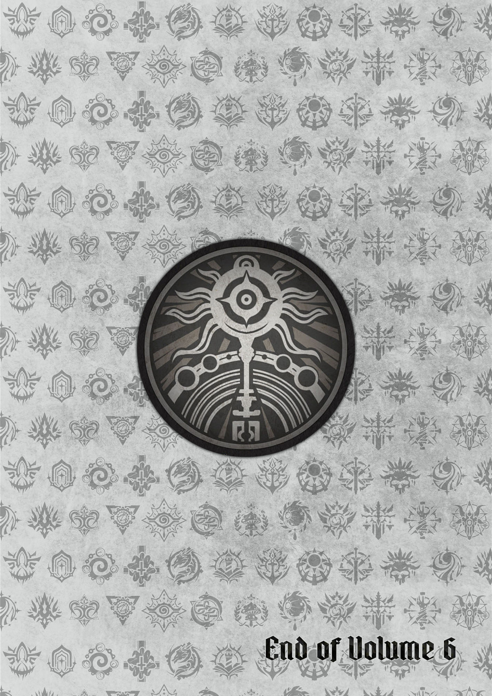

## Pathways Guide {epub:type=glossary .epub-invis}

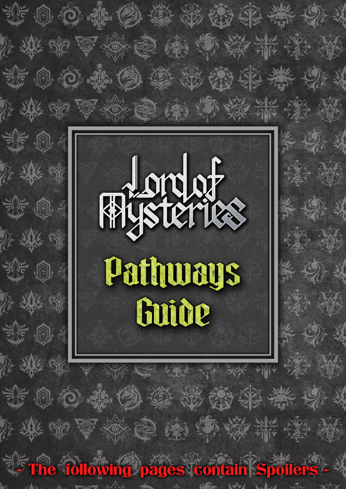

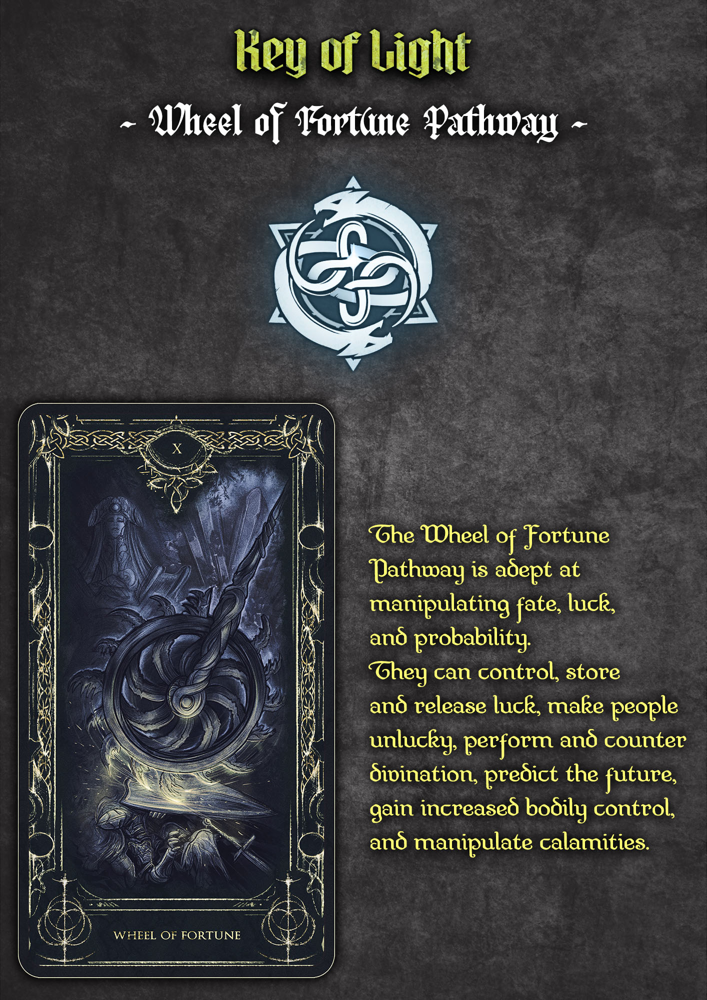

## Image Gallery  {epub:type=glossary .epub-invis}

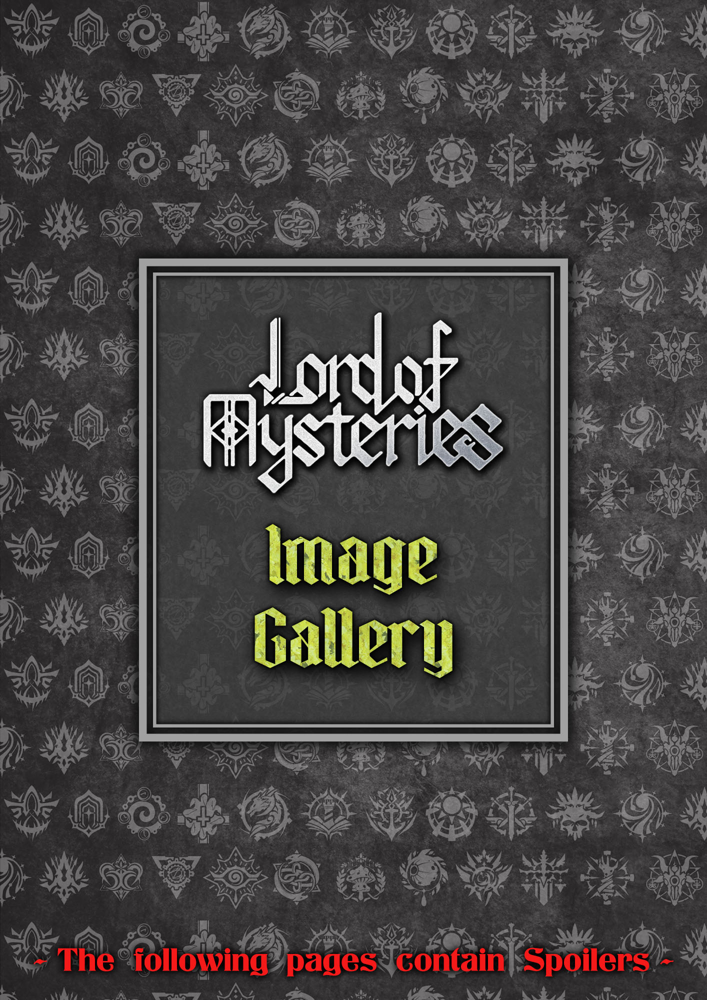

### Characters 

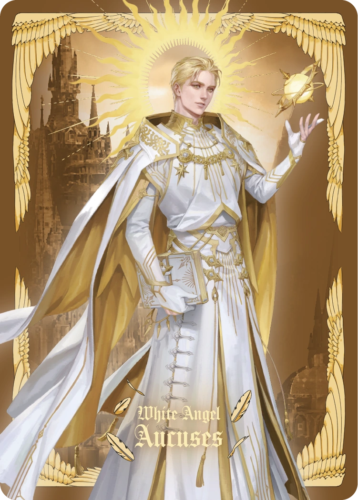

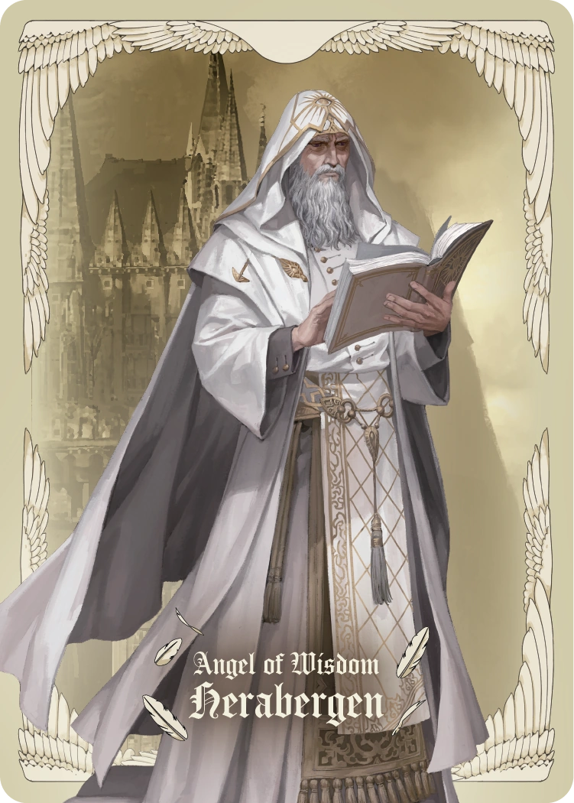

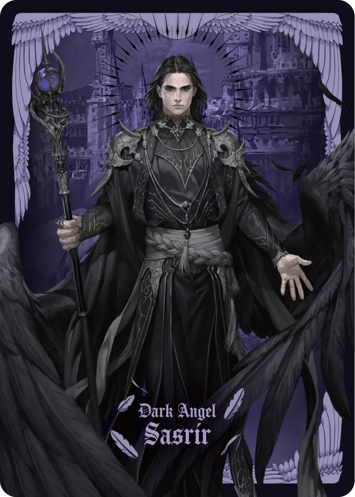

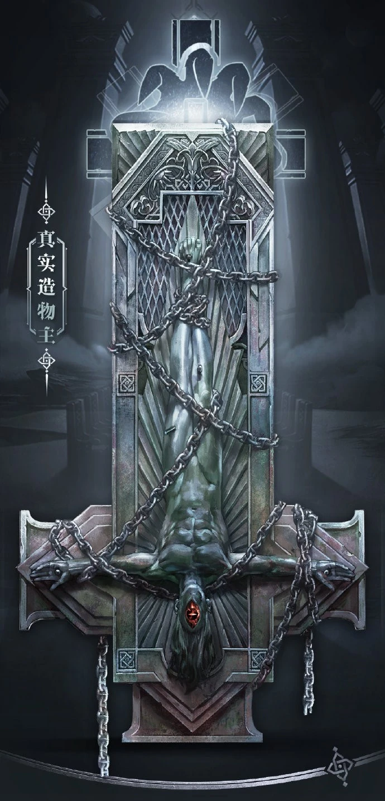

### Artworks

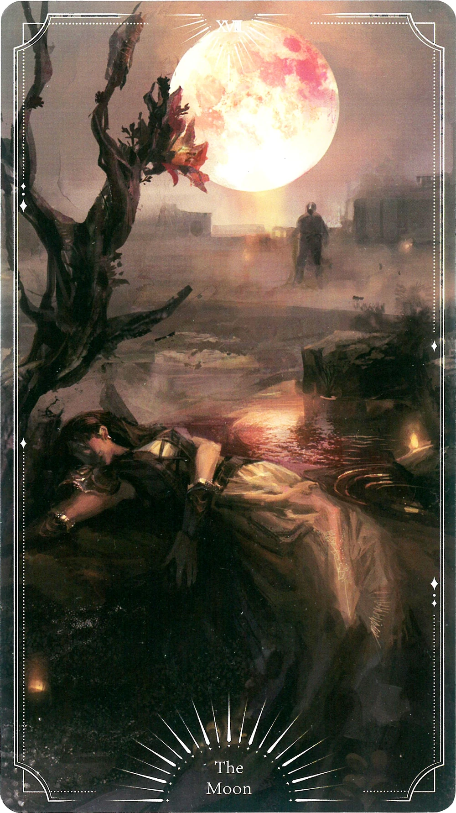

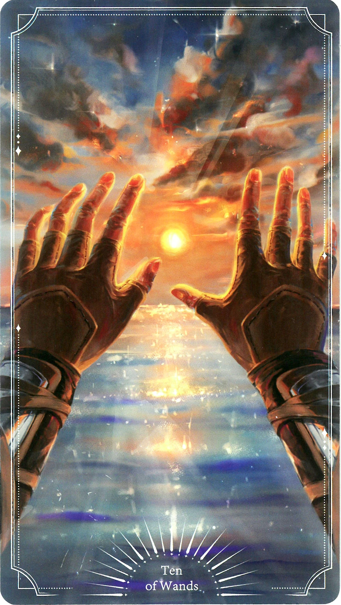

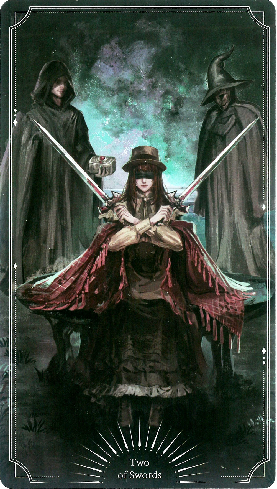

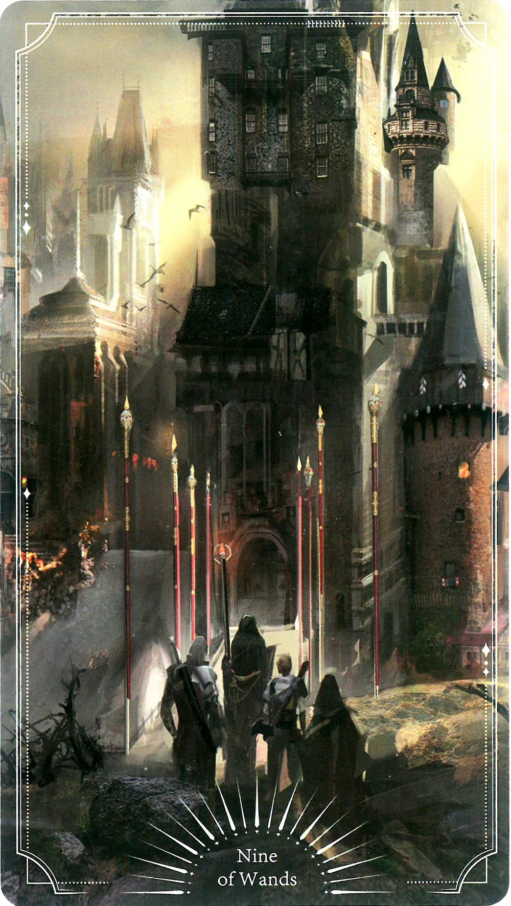

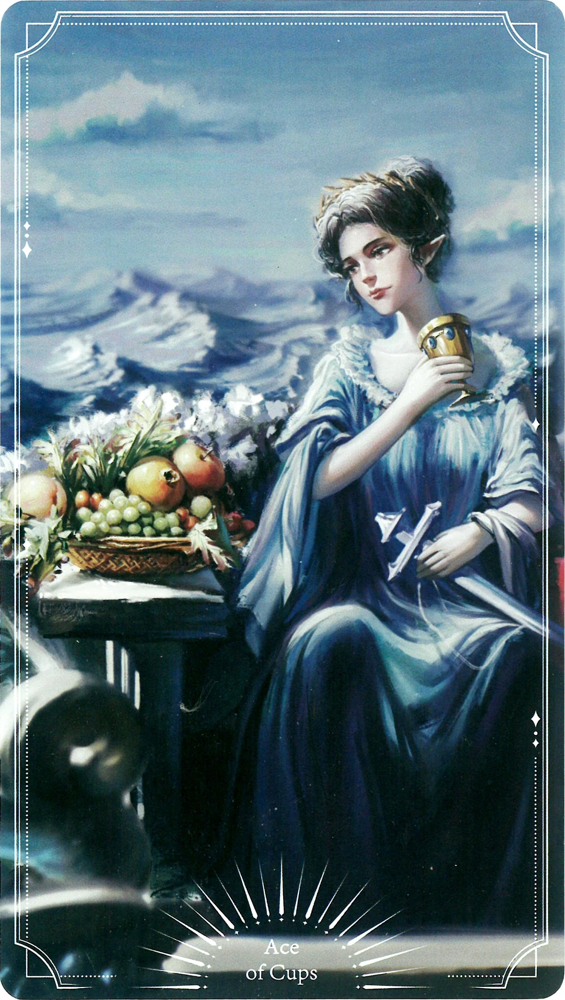

### Locations 

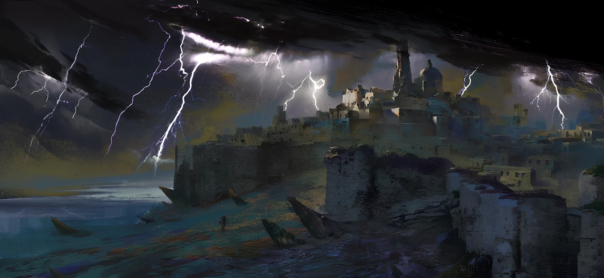

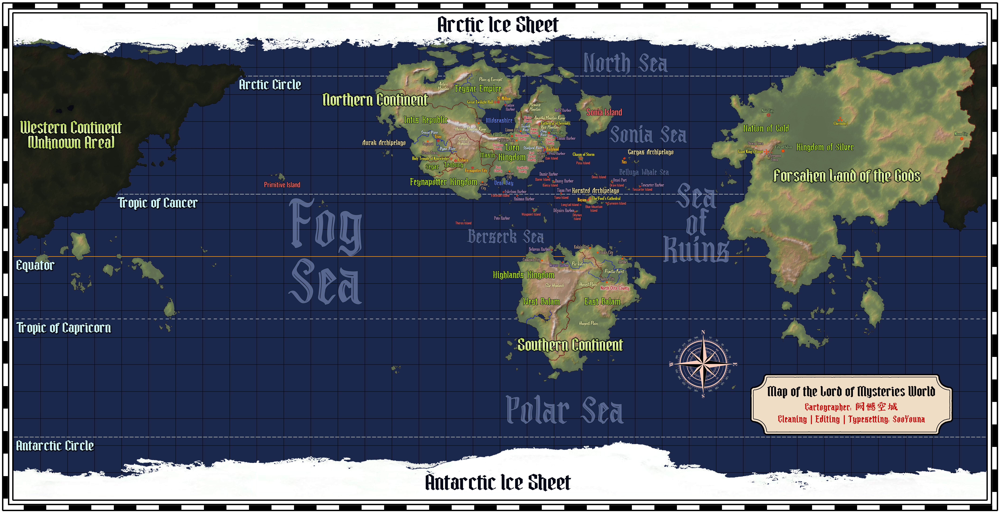