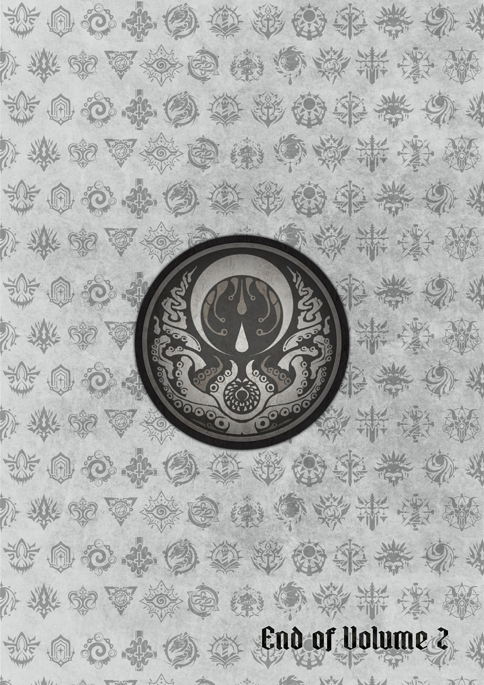
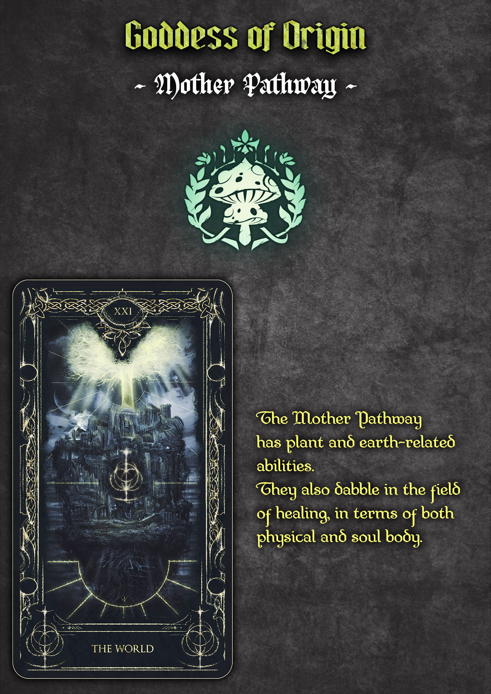
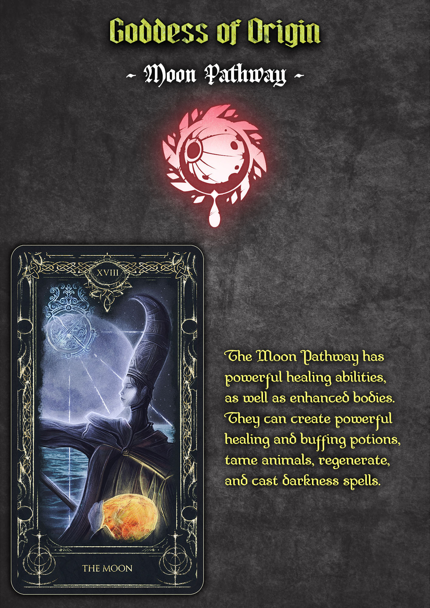
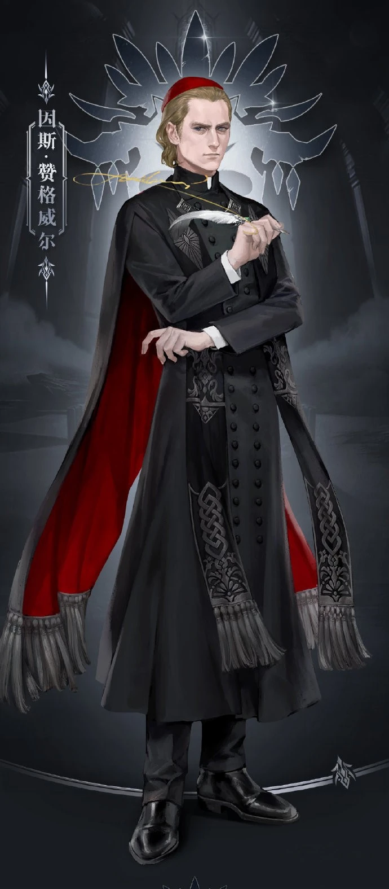
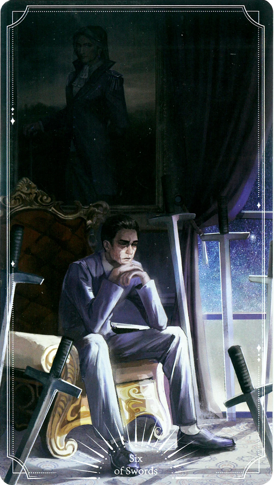
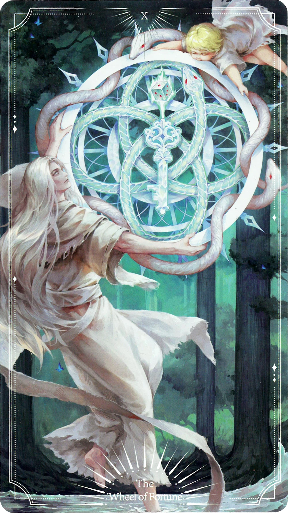
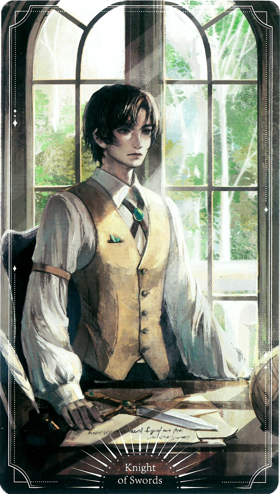

## Chapter 482: Ring out the Old, Ring in the New

Morning of the 31st December, at the Harvest Church south of the Bridge.

Emlyn White stood in a kitchen wearing his priest robes, occasionally
tossing different herbs into a large iron pot and stirring them to a
certain extent.

After all the pre-prepared ingredients were tossed in, he waited
patiently for another ten minutes. Then, he scooped up the ink-black
liquid with a metal ladle and poured it into a glass cup and glass
bottle beside him.

*48, 49, 50...* Emlyn glanced at the empty pot and counted the
medicine he had brewed.

After confirming the quantity, he picked up a large tray and brought the
bottles of dark green liquid to the hall.

In the hall, more than half of the pews had been removed, and the floor
was covered with tattered blankets. Lying within them were victims of
the plague who were either in deep sleep or groaning in pain.

Emlyn and Father Utravsky worked together, each carrying some of the
medicine, distributing it from two ends.

The first person in the queue was a middle-aged man with a sallow
complexion. He hurriedly propped himself up halfway, received the
medicine, and drank it.

He handed back the bottle and said to Emlyn in gratitude, "Father White,
thank you very much. I feel much better and have some strength again!"

Emlyn lifted his chin and replied disdainfully, "This is only an
extremely trivial matter that isn't worth being grateful for. All of you
are truly ignorant."

With that, he sped up the distribution of the potions.

After ten minutes or so, he returned to the altar of Earth Mother and
complained to Father Utravsky, "You should get two more volunteers!"

Father Utravsky didn't respond. He looked at the patients and said with
a gentle smile, "They should be completely healed in two or three days."

"How do you know?" Emlyn turned his head in surprise.

Father Utravsky looked down at him benevolently and said, "Herbal
medicine is one of the domains of the Earth Mother. As 'Her' believer, I
do know some of the basics even if I'm not part of the Earth pathway."

Emlyn tsked.

"I'm not interested in religion and know little about it."

*Although I've been copying Earth Mother's bible in the recent
months...* he inwardly added in a slightly resentful tone before
saying, "Father, I didn't expect you to accept nonbelievers in the
faith. Among them, only two or three of them are believers of the Earth
Mother."

Father Utravsky smiled without minding what he said.

"They are also lives, innocent lives."

Emlyn paused for a few seconds, exhaled, and said, "Father, I've already
found a way to resolve the psychological cue. Perhaps I will leave this
place soon."

*Wait, why did I mention this? I was actually moved by him. What if he
locks me up in the basement again?* Emlyn suddenly turned
nervous.

Father Utravsky's expression remained unchanged as he looked down and
said to Emlyn, "Actually, you didn't need to seek out solutions. In a
little while, the psychological cue will be automatically removed, and
you will be free to choose whether to come to the cathedral."

"Any longer and I would've become the Mother's, no---Earth Mother's
devout believer!" Emlyn blurted out.

Father Utravsky raised an eyebrow and said, feeling somewhat surprised,
"I didn't compel you to change your faith.

"The psychological cue I left in you was for you to return to the
cathedral every day, hoping that you would be able to fully appreciate
the value of life and the joy of a harvest."

"The only effect of the psychological cue was to make me return to the
cathedral?" Emlyn's expression instantly froze.

Father Utravsky nodded frankly.

"Yes."

"..."

Emlyn's mouth gaped as he slowly and mechanically turned his head to
look back at the altar, looking at the Earth Mother's Sacred Emblem of
Life, as if he had become a puppet that very instant.

___

In the evening of the 31st December. 2 Daffodil Street, Tingen City.

Benson entered the house, took off his hat and coat, and chuckled.

"I've booked second class tickets for the steam locomotive to Backlund
on 3rd January."

Melissa, who was sitting in the dining room with several newspapers in
front of her, worriedly said, "Benson, the air in Backlund is terrible.
Tens of thousands of people have died from the poison and diseases
caused by the smog a few days ago..."

"It's a sad and regretful matter." Benson walked to the dining room,
sighed, and said, "But the two Houses have already passed the report
submitted by the National Atmospheric Pollution Council. There will be
legislation to regulate the emission of smoke and wastewater, so a new
Backlund will welcome us. You don't have to worry too much."

Having said that, he smiled mockingly.

"When I came back from Iron Cross Street, I found a lot of factory
owners or their employees from Backlund recruiting people. They said
that due to the smog and plague, the factories there are suffering a
shortage in manpower, so they're willing to promise that the working
hours and minimum wage will be much better than the current standard,
heh heh."

"You think it's impossible?" Melissa asked.

"When more and more people flock to Backlund, it will be impossible
unless both Houses pass the corresponding laws directly." Benson spread
his hands and pointed to the table. "Well, it's time to receive the new
year."

There were three sets of forks and knives, three empty porcelain plates
and three cups on the table.

Three cups. One for beer, two for ginger beer.

___

In the evening of 31st December.

Dressed to the nines, Audrey stood inside a lounge, waiting for the
start of the New Year's Party. However, one couldn't see the excitement,
exuberance, and joy on her face despite the fact that she was about to
become an adult.

In front of her was a newspaper. On it was written:

"...According to preliminary estimates, a total of over 21,000 people
died in the smog, and the subsequent plague took the lives of close to
40,000 people. Among the deceased were young children, healthy young
men, and women..."

*Phew.* Audrey couldn't help but close her eyes.

Just then, her father, Earl Hall, and her mother, Lady Caitlyn, knocked
on the door and said in unison, "Your beauty surpasses everyone tonight.
Darling, it's time. The queen is waiting for you."

Audrey slowly breathed out and wore an elegant and beautiful smile. She
then walked out of the lounge and entered the party's hall, under the
company of her parents.

She walked all the way up to the front of the dais and, under the gaze
of many, handed her white, muslin-gloved hand to the queen.

The queen led her to the edge of the dais as they faced all the guests.

After a short pause, the queen smiled and said, "Although this is a dark
period in Backlund's history, we still have a gem that can illuminate
the entire city. Her wisdom, her beauty, her character, her etiquette,
are all impeccable.

"Today, I will formally introduce her to you.

"Lady Audrey Hall."

*Bang! Bang! Bang!*

Outside the window, the fireworks exploded into a dreamy light.

On the last night of 1349, Audrey officially came of age and was
presented to society.

___

In the afternoon of 3rd January 1350.

On the outskirts of East Borough, in a newly opened cemetery.

Using divination, Klein found the graves of Old Kohler and Liv.

This wasn't a grave in the truest sense of the word, but rather a niche
where an urn was stored. They went on, row after row, stacked one above
another.

Standing there, Klein saw that not only was there no photograph or
epitaph on Old Kohler's niche, but even his name was missing.

Similar situations weren't uncommon. There were too many ownerless ashes
whose relatives and friends couldn't be located. Their names, looks, and
whatever experiences they had were unknown, nor did they garner the
interest of anyone. They were only distinguished by the numbers on the
niches.

Klein closed his eyes, pulled out a slip of paper, shook it into a piece
of metal, and carved a word on the niche's door: "Kohler."

Then, he added an epitaph: "He was a good worker. He had a wife, a son,
and a daughter. He worked hard to live."

He withdrew his wrist, and with a shake of his wrist, the black-haired,
brown-eyed, and emaciated Klein let the paper burn in his hands, as if
it was a memorial service to all the souls residing in the area.

Instead of appearing to help Daisy, who had lost her mother and sister,
he anonymously wrote to Reporter Mike Joseph, describing the girl's
predicament in detail, so as not to implicate her in his own affairs.

Mike had met Daisy, knew about her, and had enthusiastically promoted
the establishment of a corresponding charity fund. Therefore, Klein
believed that he could help her receive more help so that she could
complete her basic studies and find a stable job that could support her.

Taking two steps back, Klein looked around, taking in the names, photos,
and even the victims who had those missing.

He raised his head, let out a long breath, turned around, and left the
cemetery.

On the steam locomotive to Backlund, Melissa was engrossed in her
textbooks, and Benson was soon chatting with the passengers around him.

"It's too expensive, just too expensive. A whole ten soli, half a
pound!" A burly man who wasn't even thirty sighed from the bottom of his
heart. "If it weren't for the fact that I couldn't buy a third-class
seat or a boat ticket recently, I wouldn't have spent this money at all.
This is equivalent to half a week's worth of my salary!"

"Indeed, there are too many people heading to Backlund after the new
year," Benson agreed.

The burly man wiped off his heartbroken expression and said expectantly,
"Because they promised me 21 soli a week and that I wouldn't need to
work more than 12 hours a day, we signed a contract!

"When I receive my first payment and rent a house, my wife will come to
Backlund, and she'll be able to get a good job, a job that pays about 12
or 13 soli a week. It's said that Backlund is in dire need of people!
When the time comes, ah, we'll earn a total of over a pound and a half a
week, and we'll be able to eat meat frequently!"

"Your wish will definitely be achieved. The king has already signed the
bill, passing the law for a minimum wage and maximum working hours,"
Benson sincerely wished him well before smiling. "This is the Land of
Hope."

*Woo!*

The steam locomotive brought countless hopeful people to Backlund. The
sky was still bright, and the fog in the air had thinned a lot. The gas
lamps on the platform were no longer lit that early.

Experienced, Benson protected his sister and wallet before leaving the
station with their suitcases while following the crowd.

Suddenly, they simultaneously felt a gaze sweep past them.

Tracing the gaze, Benson and Melissa saw a young gentleman with neat
black hair and dark brown eyes.

The gentleman with the gold-rimmed glasses pressed his hat and looked
past them into the distance.

Benson and Melissa also looked away and cast their gaze to the smoky
pillars in the garden in the middle of the street as they looked forward
to seeing the underground transportation system in Backlund.

Carrying his suitcase with an expressionless look, Klein walked past
them with his body kept straight. He entered the departure station,
facing the mass of people pouring into the Land of Hope, people filled
with wonderful hopes in their hearts.

*It was the best of times, it was the worst of times.*

Author's Notes:

The second volume has written about 850,000 words, which is a very long
one in the structure. I think only the third and fourth volumes of The
Sage Who Transcended Samsara are more than it. I think and write every
day. Although I am very happy, I am really tired. Especially this month,
I also added exercise, and almost didn't even have time to read novels.

The title of this book is "Faceless", which is expected to have three
meanings. Note that the following are the standard answers for reading
comprehension.

The first is to be advance to "Faceless", which is the simplest and
easiest to think of.

The second is to represent Klein's living condition in Backlund. He uses
fake face, fake name and fake identity to get to knows people, handles
things and gets involved in disturbances. But when he returns home, he
is still lonely and deserted.

The third refers to those who have been smashed into powder or rushed in
the great era. In history books, they have no name, no appearance, no
past, no life, and exist only in simple numbers or descriptions. In a
sense, isn't this a "Faceless"? The least noticeable cannon fodder, who
cares what their faces look like?

Just like the sentence "when one is hungry, one eats another", how much
sadness, pain, cruelty, bloody and despair are contained in the simple
six words, and how many living people without faces or names are
condensed? Tens of thousands, hundreds of thousands, millions!

Therefore, I tried to give some descriptions to the Old Kohler, Liv and
Freya in the waves of the times, try to restore the hopes, hardships and
tragedies of these "Faceless" making them look like people instead of
numbers. Although this second part is a big reason for scattered, it is
the hidden main line.

As they passed away, more people like them flock in, "Faceless" always
existed. They were the stepping stones of the times, the pioneers of the
times, and the indispensable roles of the whole story.

With this in mind, I abandoned the more sorrowful and shocking ending.
After all, this one is called the faceless people. The best times of the
worst era are reversed and echoed, which I can express my desire very
well and powerfully. The times is advance, merciless and helpless, but
there are countless faceless people lying under their feet.

The title of the third volume will not have so many symbolic meanings,
because the main line is very clear and direct. Well, the name of the
third volume is "Traveler".

Looking at the meaning of the text, everyone should be able to imagine
something, but we will still focus on the second part. There are many
things in Backlund that haven't been collected, such as the Snake of
Mercury, such as the underground evil spirit, such as the royal family's
real plot, such as 0-17, such as vampire, such as Psychology Alchemists.
This is because we need to give opportunities to Audrey, Fors, Xio and
Emlyn in Backlund to show themselves. And because Backlund is the most
important stage of the whole novel. Klein will definitely come back and
stay for a long time.

The second volume said that it was scattered. In fact, after a lot of
things were strung together, it was fine. For me, scattered but
attractive writing is not bad. The real problem is another point, that
is, the rhythm of the story has been relatively tense and tight, not
relaxed. In other words, it is constantly encountering events and
solving problems. It lacks long enough and easy excess in the middle and
it's a bit tired and irritating. Although this leads to the special
characteristic aggregation effect, it does have some problems from the
setting.

The problem is the Tarot Club will be held once a week, so the timeline
will be cut into week after week. It is easy to feel repetitive and
inflexible. It is also necessary to keep certain events in each week.
Therefore, the rhythm of extraordinary events will be somewhat tight.
The solution I am currently considering is to skip some less important
Tarot meetings and be more free in time control.

Of course, the Tarot Club itself is also the main body, and it will
definitely not be less. For the first time since Emlyn joined, I have
not forgotten that there are many friends who mentioned various things,
such as the church's reaction, such as another bronze whistle. I
remember all of them, but deliberately pressed not to write them and
prepared to leave them until the beginning of the third volume.

This is not to let the trivial things dilute or destroy the overall
picture feeling and emotional of two pieces, so we can only carry out
certain technical processing.

When the second volume was finished, I am very glad to see that the
roles have been set up one by one, which makes everyone like it. It's
not impossible to use 0-17 to end with violence. On the one hand, it's
still awesome to write about the church, which can be the ruling class
for so long, not without reason. On the other hand, it is not the ending
itself, it is just a continuation, a link between the preceding and the
following, pointing to some subsequent things. Let's not talk about it
in detail, as not to be a spoiler.

Finally, when writing a novel, I am more and more pursuing simplicity
and puncturing. That is to say, what can be described accurately with
the easiest and simplest words is to try not to give a long speech, not
to fill it with gorgeous things, to accumulate emotions step by the most
calm and objective white description, at the most appropriate time,
pierce the barrier with the most precise and simple language, and pierce
the softest place in your heart.

Now, although there are still many problems, they are just on the way.

Of course, the characteristics of online writing are doomed. I can only
do it in the most important and needed chapters. It is impossible to
write it in every chapter. A lot of things can only be repaired when I
am old and free. In general, I have a lot of vocabulary, but all of them
are unfamiliar. After all, they are accumulated step by step and are
useless. That is to say, when code words are used habitually, they are
used in the list commonly used in the brain. so the problem of repeated
words is hard to avoid.

Also, similar to the problem of misusing some adjectives is to present
the clearest, most intuitive and most important pictures in my mind, so
I try to create some words, but it still needs to be explored and
improved.

The above is the technical summary of the second volume.

Writing is a very hard and torturous thing, but when I write it out, I
praised, pleasant, especially happy and satisfied. Recently, everyone
praised me for being full of enthusiasm.

Gentlemen, I like to write novels!

I like to tell you stories!

I like to create plump characters one by one!

I like to show you an interesting and novel world!

Writing novels is really a joy!

Well, it's a mystery that today, the high-end subscription of the pure
starting platform is 53,000, but it's all over 41, but after 24-hour
subscription is 27-28,000 and the lastest chapters have officially
broken through 31,000, which shows that the retention rate is high,
which shows that most of the people who have seen are chasing, which
shows that you are full of love!

Also, recommended votes have been in the top 15 and monthly tickets have
been in the top 5. I am too lazy to brush any data. Therefore, every
ticket, every reward and every subscription are full of love!

Gentlemen, the second volume is over. I want to ask for praise and a
monthly ticket!

Asking for a monthly passsssssss\~

At the end of the day, according to the Convention, we have two days
off, that is, Monday and Tuesday. On Wednesday, at 12:30 noon, it's
still the same time.

What, you say Sunday? I didn't hear it, I didn't hear it... Well, I'm
kidding. Let's have a rest for half a day after such a long one.

The third volume, "Traveler", please look forward to it.

___

## Pathways Guide {epub:type=glossary .epub-invis}

## Image Gallery  {epub:type=glossary .epub-invis}

### Characters 

### Artworks

### Locations 

