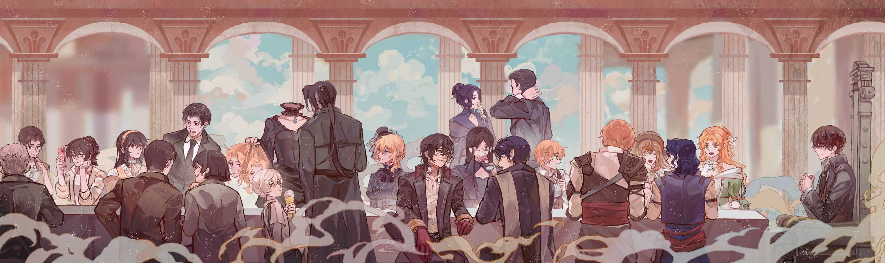

# LOTM-Reader

**LOTM-Reader** is a fan-made project hosting unofficial fan translations of the popular webnovel ***Lord of the Mysteries!***

🌐: [beyonder.pages.dev](https://beyonder.pages.dev) \
📥: [Download EPUBs](https://beyonder.pages.dev/download/) \
⭐: Don't forget to star this repository!

---

## 📖 About LOTM

**Lord of the Mysteries (LOTM)** is a masterpiece of steampunk, fantasy, and eldritch horror following Zhou Mingrui, who transmigrates into the body of Klein Moretti in a Victorian-era world filled with machinery, cannons, and Beyonders. The series includes:

 \
 \

Learn more about the author, **Cuttlefish That Loves Diving**:

 \

---

## ✨ Features

* **Custom Themes:** Multiple themes to fit the atmosphere of the stories.
* **High-Quality Illustrations:** Official art and community-curated illustrations have been added to the site to enhance immersion.
* **Reader Settings:** Customize your reading experience with adjustable font size, line height, and more.
* **EPUB Downloads:** Download the complete volumes as EPUB files for offline reading on your Kindle, Kobo, or phone.
* **Community Driven:** The website is built with the latest fan translations and can be edited by the community. That includes you, too!
* **Privacy Focused:** The website does **NOT** have any kind of trackers or ads. We prefer the purity of the Beyonder characteristics.

---

## 🤝 Contributing

We welcome contributions from the community! Whether it's fixing typos, improving formatting, or adding new features.

- [**Contribution Guide**](./CONTRIBUTING.md).

Have questions? Join our [Discord Server](https://discord.gg/XmzJVsyuTQ).

---

## 📥 Download EPUBs

You can download the complete volumes as EPUB files for offline reading. All EPUBs include high-quality illustrations and are compatible with most e-readers.

📚 **[Go to Download Page](https://beyonder.pages.dev/download/)**

---

## Official Links

### Novel

* [Official English Translation (Webnovel)](https://www.webnovel.com/book/lord-of-mysteries_110227330062345055)

### Circle of Inevitability

* [Book 2 English (Webnovel)](https://www.webnovel.com/book/lord-of-mysteries-2-circle-of-inevitability_25759730405792805)

### Donghua (Anime)

* [WeTV Trailer](https://wetv.vip/en/play/7o961rwa3bmfgob-Lord_of_Mysteries)
* [Anilist Entry](https://anilist.co/anime/137667/Guimi-Zhi-Zhu)
* [MyAnimeList Entry](https://myanimelist.net/anime/49818/Guimi_Zhi_Zhu__Xiaochou_Pian)

---

## 💖 Support the Project

If you enjoy LOTM-Reader and would like to support the project server costs, you can donate using **Crypto**, **Gift Cards**, or **Steam games**.

**[Visit Donation Page](https://beyonder.pages.dev/donate.html)**

You can also contact me directly via Discord **@bittu5134** or email [ssr7a5134@gmail.com](mailto:ssr7a5134@gmail.com).

---

## 📜 Sources

The content is sourced from fan translations and online communities, including:

---

## ⚖️ Legal Information

**We do not own the rights to the original novel.** All translations available on this page are fan translations sourced from the public Internet.

Support the creator, **Cuttlefish That Loves Diving**, by purchasing official releases through the links above.

* **[View Full License & Credits](./LICENSE.md)** - Includes art credits and DMCA info.
* **[Source Code License](./LICENSE.md#website-code-license)** - MIT License for the website engine.

For any inquiries, reach out via email at <a href="mailto: ssr7a5134@gmail.com">ssr7a5134@gmail.com</a>.

---

## ⭐ Star History

<a href="https://www.star-history.com/#Bittu5134/LOTM-Reader&Date">
 <picture>
   <source media="(prefers-color-scheme: dark)" srcset="https://api.star-history.com/svg?repos=Bittu5134/LOTM-Reader&type=Date&theme=dark" />
   <source media="(prefers-color-scheme: light)" srcset="https://api.star-history.com/svg?repos=Bittu5134/LOTM-Reader&type=Date" />
   
 </picture>
</a>

